# Designing Our Flashcard Game in Scratch 🎮📚

**Welcome to your coding adventure!** You’ll experience how software developers build real apps—scrum, MVPs, and all—while having fun with flashcards. You’ll need a **sponsors** (a teacher) to try out your game and give feedback. We work in **three sprints** (1 week each). You can code solo or with a buddy! 🤖✨

**Prerequisites:** Basic familiarity with Scratch—knowing how to create sprites, lists, variables, and use broadcast messages and event handlers.

## User Stories 📝

1. **Teacher Admin**: “I want to add word pairs by week using a simple input interface before students play, then lock access so no further edits are possible during gameplay.” 🔒
2. **Student Player**: “I want to pick a week and practice the flashcards to learn English!” 🌟
3. **Student Player**: “I want to add word pairs by week using a simple input interface before students play, then lock access so no further edits are possible during gameplay.” 🔊

*These stories form our **scope** and define the features (MVP—Minimum Viable Product).*

## Architecture Diagram 📊

```mermaid
flowchart TD
  Sponsor["👩‍🏫 Sponsor/Teacher"] --> ScratchApp["🖥️ Scratch App"]
  ScratchApp --> DataStore["📦 Data Store\n(lists + vars)"]
  ScratchApp --> Control["⚙️ Control Logic\n(Load, Flip)"]
  ScratchApp --> UI["🎨 UI Modules\n(Week, Card, Next)"]
  Students["👩‍🎓 Students"] --> ScratchApp
```

* **Data Store:** Maintains all lists and variables.
* **Control Logic:** Implements user stories via broadcast messages and handlers.
* **UI Sprites:** Separate sprites handle user input (buttons) and output (card display, audio).

## Data Model  🗂️
Define the core data structures that represent the application’s state:

| Entity         | Type             | Description                                             |
| -------------- | ---------------- | ------------------------------------------------------- |
| `EnglishWeekN` | List of strings  | English vocabulary for week N                           |
| `SwedishWeekN` | List of strings  | Swedish equivalents for week N                          |
| `CurrentWeek`  | Integer variable | Index of the active week (1…N)                          |
| `CardIndex`    | Integer variable | Index within the selected week’s list                   |
| `FrontSide`    | String variable  | Text shown on the front of the flashcard                |
| `BackSide`     | String variable  | Text shown on the back of the flashcard                 |
| `IsLocked`     | Boolean variable | Flag indicating whether administrator input is disabled |

A well-defined data model serves as a blueprint; changing variable names or list structures mid-project can introduce errors across all scripts.

> **Hint (KISS & DRY)**: Keep names clear (no `E1`/`S1`) so you don’t confuse lists. DRY = Don’t Repeat Yourself; reuse variables instead of new ones for each week.

## Mapping User Stories → Modules 🚀

| User Story                 | Module/Sprite          | Functionality                                                                                    |
| -------------------------- | ---------------------- | ------------------------------------------------------------------------------------------------ |
| Teacher adds & locks cards | **Admin** sprite       | "ask…" blocks populate lists until `IsLocked=1`                                                  |
| Choose week & load a card  | **WeekButton** sprites | set `CurrentWeek`, broadcast `LoadCard`                                                          |
| Show & flip card           | **Card** sprite        | on `LoadCard`: pick random `CardIndex`, show `FrontSide`; on click: show `BackSide` + play sound |
| Hear pronunciations        | **Card** sprite        | `play sound [word_EN]` / `play sound [word_SE]`                                                  |
| Next card                  | **NextButton** sprite  | broadcast `LoadCard`                                                                             |

Assigning each user story to a distinct module increases **separation of concerns**, simplifying debugging and future enhancements.

## Implementation Steps in Scratch 🛠️

1. **Set up Data** (like defining your DB tables):
   * Create lists: `EnglishWeek1…EnglishWeekN`, `SwedishWeek1…SwedishWeekN`
   * Create variables: `CurrentWeek`, `CardIndex`, `FrontSide`, `BackSide`, `IsLocked`
1.  **Admin Mode**:
   * In Admin sprite: on green-flag → `set IsLocked to 0`.
   * If `IsLocked=0`, `ask [Week?]`, `ask [English?]`, `ask [Swedish?]`, add answers to correct lists.
1. **Lock Admin**:
   * Teacher clicks a custom button or script to `set IsLocked to 1`.
1. **Week Buttons**:
   * Each WeekX button: on click → `set CurrentWeek to X` → broadcast `LoadCard`.
1. **Card Sprite**:
   * On `LoadCard`:
     * `set CardIndex to pick random 1 to length of EnglishWeek(CurrentWeek)`
     * `set FrontSide to item CardIndex of EnglishWeek(CurrentWeek)`
     * `set BackSide to item CardIndex of SwedishWeek(CurrentWeek)`
     * `say FrontSide`
   * On click:
     * `play sound [FrontSide_EN]`; `say BackSide`; `play sound [BackSide_SE]`
1. **Next Button**:
   * On click → broadcast `LoadCard`
1. **Test & Iterate**:
   * Run each module (Admin, Load, Flip) separately; fix bugs; refine UI positions.

 

## Three‑Week Plan ⏱️

You can complete this project in **three weeks**, spending **a few hours** each week. After each week’s work, your sponsor (teacher or mentor) will test your game to make sure everything works and give you feedback.
| Week | Activities |
| ---- | --------------------------------------------------------------------------------------------- |
| 1    | Set up lists & variables; Build the Admin input interface and add a few sample words; Sponsor tests data entry and lock feature |
| 2    | Create buttons to select weeks; Implement loading a card and flipping from front to back; Add pronunciation sounds; Sponsor checks game flow |
| 3    | Add the “Next” button to advance cards; Finalize the lock mechanism so no more edits can occur during play; Polish the user interface layout; Sponsor conducts final playtest and approval |

*At the end of each week, a quick demo to your sponsor helps catch issues early and makes your game stronger!*

# Engineering Hints & Self-Learning Tips 🔍

* **Scratch & Community**: Check Scratch’s built-in docs (Help → About Blocks) or the Scratch Wiki.
* **YouTube & Google**: Search "Scratch flashcard tutorial" or "Scratch get random item" for example projects.
* **Rubber Duck Debugging**: Explain your script to a buddy or even a stuffed toy! Bugs often vanish when you talk through them.
* **Refactor Early**: If your code feels messy, pause and reorganize sprites or variable names—clean code is happy code!
* **Separation of Concerns:** Keep data-loading logic separate from UI logic. Changes in one module should not break another.
* **Consistent Naming:** Use descriptive names (e.g., `EnglishWeek1` rather than `EW1`) to avoid confusion when referencing lists in scripts.
* **Modularity:** Encapsulate each feature (admin, week select, card display) in its own sprite to support independent testing and future extension.
* **Error Handling:** Consider adding feedback (e.g., `say "No cards available"`) if a list is empty or `IsLocked = true` when trying to add cards.

#  Glossary of Cool SW Terms 🚀

* **MVP (Minimum Viable Product)**: The simplest version of your game that works.
* **Sprint**: A short, time-boxed development cycle.
* **Refactor**: Reorganize or clean up code without changing behavior.
* **Debug**: Find and fix errors (bugs) in your scripts.
* **KISS**: Keep It Simple Stupid.
* **DRY (Don’t Repeat Yourself)**: Avoid copying code—reuse variables and scripts.
* **Modularization**: Split your game into small, independent parts (sprites) for easy maintenance.
* **User Story:** A concise description of functionality from an end-user’s perspective.
* **Data Model:** The schema or organization of data (lists, variables) in the app.
* **Module:** A self-contained component (sprite) responsible for a specific feature.
* **Broadcast:** Scratch’s messaging system to signal between sprites.
* **Separation of Concerns:** Design principle to divide a program into distinct features that overlap in functionality as little as possible.
* **Sprint:** A fixed-duration period in agile development for completing a set of tasks.
* **Iteration:** Repeated cycles of development, testing, and refinement.

